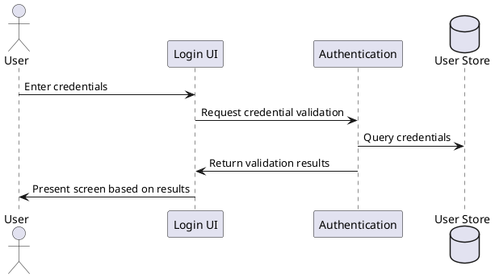
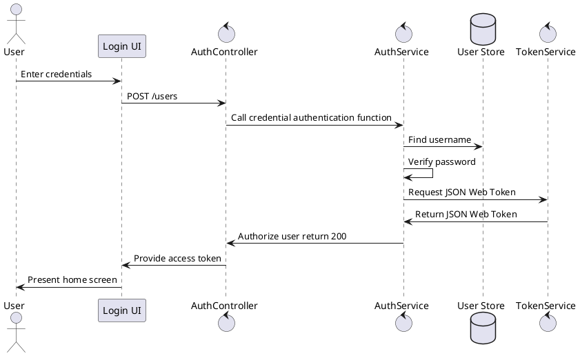

These sequence diagrams visually represents the user login data flow in the layered architecture

<u>Basic Happy Path Overview</u>:

```plantuml
@startuml
actor User
participant "Login UI" as Login
participant Authentication
database "User Store" as Database

User -> Login : Enter credentials
Login -> Authentication : Request credential validation
Authentication -> Database : Query credentials
Authentication -> Login : Return validation results
Login -> User : Present screen based on results
@enduml

```

<u>Advanced Happy Path Overview</u>:

```plantuml
@startuml
actor User
participant "Login UI" as Login
control AuthController
control AuthService
database "User Store" as Database
control TokenService

User -> Login : Enter credentials
Login -> AuthController : POST /users
AuthController -> AuthService : Call credential authentication function
AuthService -> Database : Find username
AuthService -> AuthService : Verify password
AuthService -> TokenService : Request JSON Web Token
TokenService -> AuthService : Return JSON Web Token
AuthService -> AuthController : Authorize user return 200
AuthController -> Login : Provide access token
Login -> User : Present home screen

@enduml

```